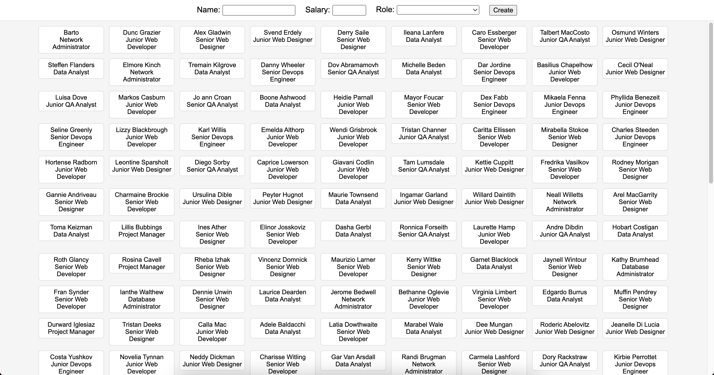

<h1 align="center"> Lista de funcionários </h1>

Projeto em CRUD desenvolvido no Bootcamp de Frontend da XPEducação.

<strong>IMPORTANTE:</strong> Para experienciar as funcionalidades da página 100%, baixe o arquivo "backend", abra a pasta do arquivo no terminal do seu computador e rode o comando "npm install" seguido do "npm start".

  <a href="#-tecnologias">Tecnologias</a>&nbsp;&nbsp;&nbsp;|&nbsp;&nbsp;&nbsp;
  <a href="#-projeto">Projeto</a>&nbsp;&nbsp;&nbsp;|&nbsp;&nbsp;&nbsp;
  <a href="#-layout">Layout</a>&nbsp;&nbsp;&nbsp;|&nbsp;&nbsp;&nbsp;
  <a href="#memo-licença">Licença</a>

  

 

  
   

## 🚀 Tecnologias

Esse projeto foi desenvolvido com:

- HTML, CSS e JavaScript
- Json e API Fetch
- Git e GitHub

## 💻 Projeto

Página com a lista de funcionários de uma empresa onde podemos editar, adcionar ou excluir informações sobre determinado funcionário.

## 🔖 Layout

Você pode visualizar um pouco do layout do projeto no topo desse readme.

## :memo: Licença

Esse projeto está sob a licença MIT.

---

Design by Rafaelly Lemos :wave: - [Acesse o meu LinkedIn](https://www.linkedin.com/in/rafaelly-lemos)
